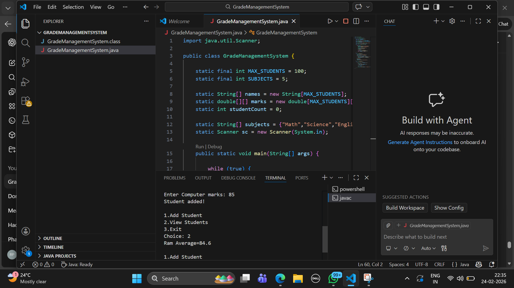
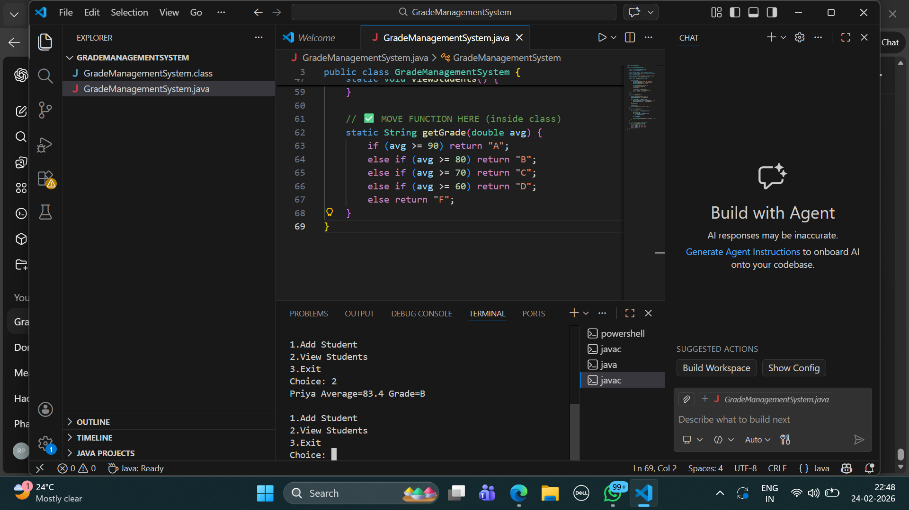
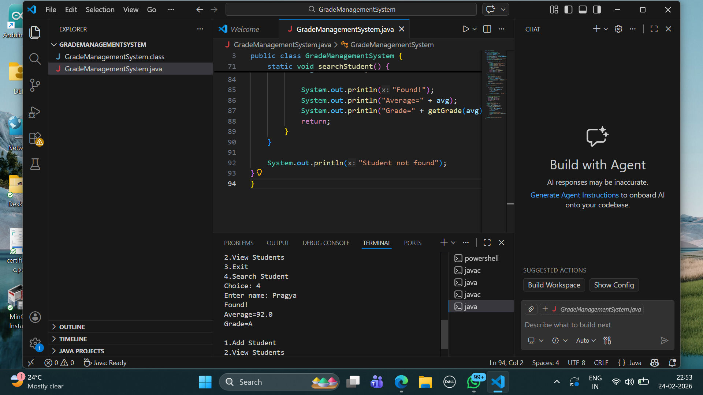

# Grade Management System Documentation

## Project Description
The Grade Management System is a Java program that manages student academic records.  
It stores student names and marks, calculates averages, assigns grades, and generates reports.

## Objectives
- Store student marks using arrays
- Calculate average marks
- Assign grade categories
- View and search student data
- Identify top performer
- Generate performance report

## Data Structures Used
- String[] names → stores student names
- double[][] marks → stores marks of 5 subjects
- int studentCount → total number of students

## Functional Modules
1. Add Student  
2. View Students  
3. Grade Calculation  
4. Search Student  
5. Top Performer  
6. Performance Report  

## Grade Criteria
- A : 90–100  
- B : 80–89  
- C : 70–79  
- D : 60–69  
- F : Below 60  

## How the System Works
1. User enters student name and marks  
2. Marks stored in arrays  
3. Average calculated using loop  
4. Grade assigned using conditions  
5. Reports generated from stored data  

## Conclusion
The system demonstrates the use of arrays, loops, and conditional logic in Java to manage student academic data efficiently.

---

## Program Screenshots

### Add Student & Menu

### Search Student Output

### Report Output
